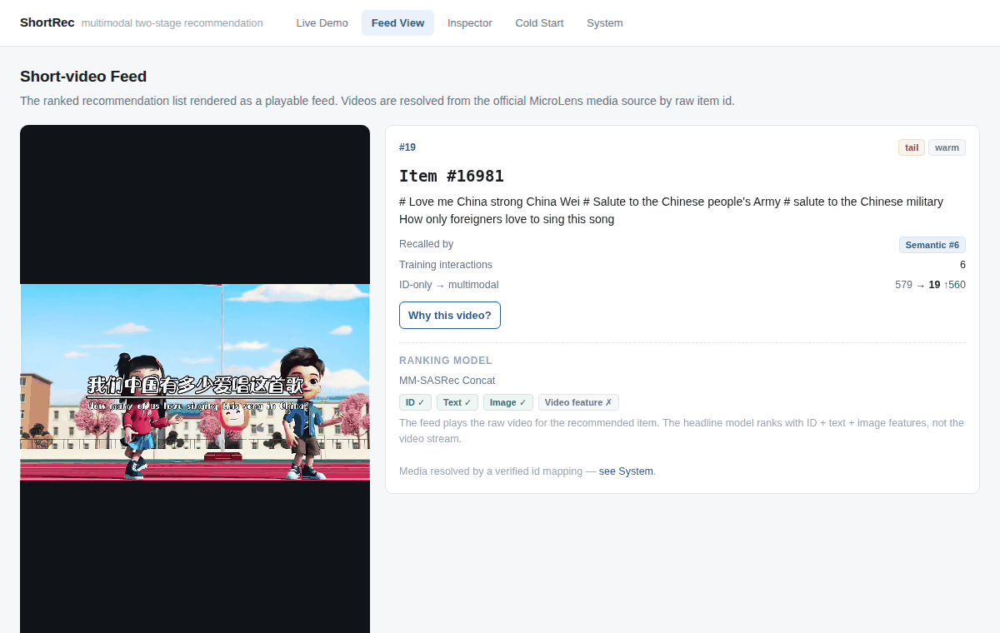
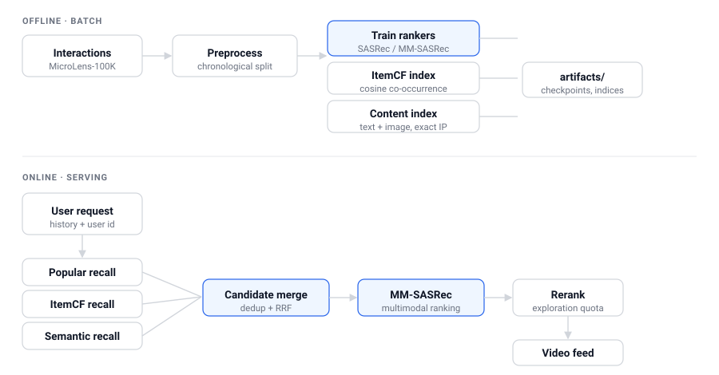
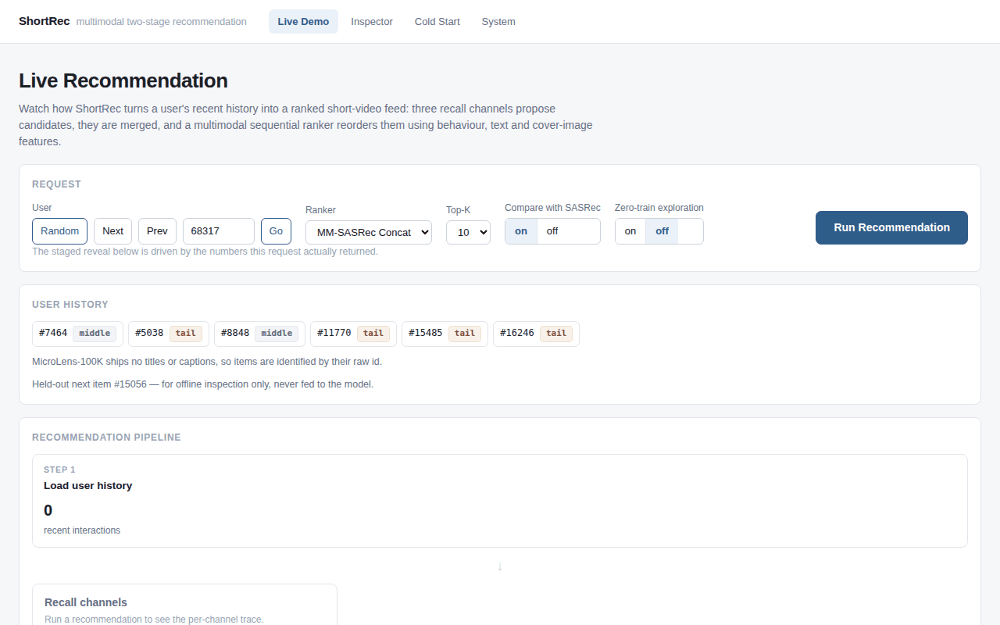
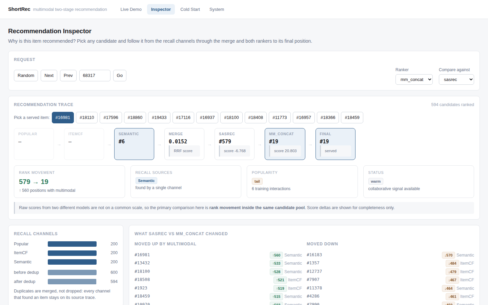
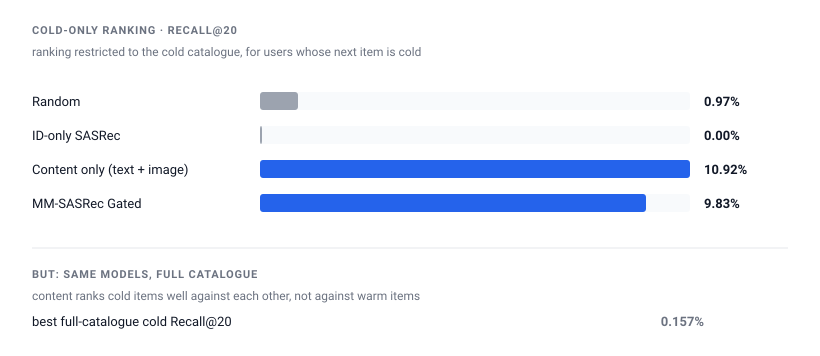
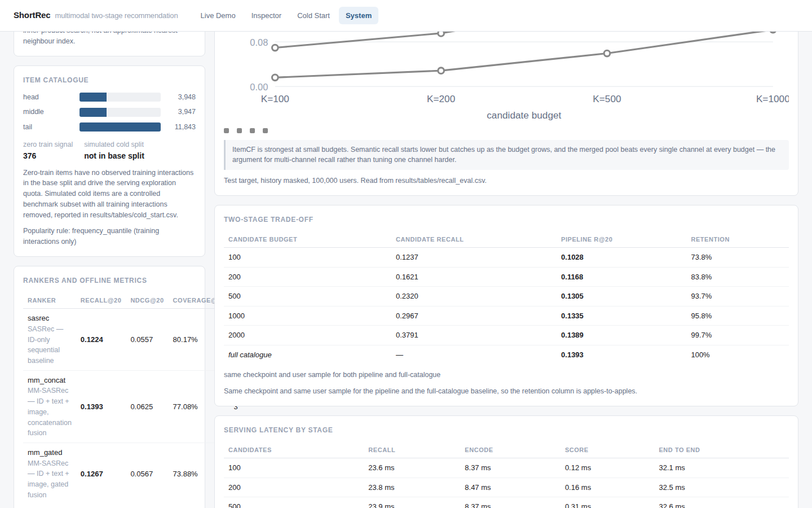

<h1 align="center">ShortRec</h1>

<p align="center"><strong>Multimodal Two-Stage Recommendation for Short-Video Feeds</strong></p>

<p align="center">Multi-Channel Recall · MM-SASRec · Cold Start</p>

<p align="center">
  <a href="#product-demo"><b>Watch Feed</b></a> ·
  <a href="#system-demo"><b>System Demo</b></a> ·
  <a href="#architecture"><b>Architecture</b></a> ·
  <a href="#quick-start"><b>Quick Start</b></a> ·
  <a href="https://github.com/Idiotyevsky/MMRec/actions/workflows/tests.yml"><b>CI</b></a>
</p>

<a id="product-demo"></a>

## Product Demo

<p align="center">
  
</p>

<p align="center"><sub>Real MicroLens video · MM-SASRec ranking · live recommendation trace</sub></p>

The ranked recommendation list rendered as a playable feed: swipe through the
served items and ask *why this video?* for any of them.

<!-- CASE:MEDIA -->
Media is resolved from the official MicroLens source through a verified id mapping — 99.985 % timestamp agreement, 19,738-item bijection. [How it is verified →](docs/media_provenance.md)
<!-- /CASE:MEDIA -->

Playback uses the raw video for visualization; the headline MM-SASRec ranker uses
ID + text + image features.

## Key Results

<!-- HERO:METRICS -->
<table>
<tr>
<td align="center" width="33%">

<br/>
<strong>13.93%</strong><br/>
Recall@20<br/>
<sub>+13.8% vs SASRec · 3 seeds</sub>

</td>
<td align="center" width="33%">

<br/>
<strong>30.0%</strong><br/>
Recall@1000<br/>
<sub>multi-channel recall pool</sub>

</td>
<td align="center" width="33%">

<br/>
<strong>95.8%</strong><br/>
Recall retained<br/>
<sub>1000 candidates · same checkpoint</sub>

</td>
</tr>
</table>
<!-- /HERO:METRICS -->

Full-catalogue ranking on the held-out test split, 3 seeds. Multi-channel recall
measured over 100 000 users. Retention compares the two-stage pipeline against
the **same checkpoint and the same users** ranked over the whole catalogue.

---

## System

### Architecture

<p align="center">
  
</p>

| Stage | Implementation |
|---|---|
| Recall | Popular (training frequency) · ItemCF (cosine co-occurrence) · Semantic (text + image, exact inner-product search) |
| Merge | Reciprocal Rank Fusion over ranks, with every contributing channel kept on the candidate |
| Rank | MM-SASRec — the user behaviour sequence scored against ID + text + image item representations |
| Rerank | seen filter · dedup · optional zero-train exploration quota |

> **Two protocols, never mixed.** *Full-catalogue ranking* scores every item and
> is the strict model comparison. *Two-stage ranking* scores only recalled
> candidates and simulates serving. Pipeline numbers are always reported against
> a same-checkpoint, same-user full-catalogue baseline.

<a id="system-demo"></a>

### System Demo

**How a recommendation is produced** — history → recall → merge → multimodal
ranking → recommendation trace.

<p align="center">
  
</p>

<p align="center"><sub>Captured from the running application; every value is from the live request.</sub></p>

### One Real Recommendation

<!-- CASE:DEMO -->
**User `68317` · Item `16981`** — *# Love me China strong China Wei # Salute to the Chinese people's...*

<table>
<tr>
<td align="center" width="33%">

<br/>
<strong>Semantic</strong><br/>
<sub>only recall source</sub>

</td>
<td align="center" width="33%">

<strong>#579</strong><br/>
<sub>ID-only SASRec</sub>

</td>
<td align="center" width="33%">

<strong>#19</strong><br/>
<sub>MM-SASRec</sub><br/>
<strong>&#8593;560</strong>

</td>
</tr>
</table>
<!-- /CASE:DEMO -->

Item 16981 is not recalled by Popular or ItemCF — semantic content recall is the
only channel that retrieves it. Inside the same candidate pool, ID-only SASRec
ranks it #579 and MM-SASRec moves it to #19.

<p align="center">
  
</p>

<p align="center"><sub>The same recommendation traced across recall, merge, ID-only ranking and multimodal ranking.</sub></p>

This is one real request trace, not evidence that every multimodal gain comes
from semantic-only items — the aggregate effect, including the cases where
multimodal **loses**, is in the ablations below.

### Why ShortRec

A short-video platform produces new videos continuously. Those items have no
clicks, no watch history and no co-occurrence, so a learned ID embedding has
nothing to learn from — while content features exist the moment a video is
uploaded. The question is not "content instead of collaborative filtering", but
whether content semantics can complement a strong ID signal on warm items and
carry the load where that signal is missing.

| Users | Items | Interactions | Sparsity | Zero-train items |
|---|---|---|---|---|
| 100 000 | 19 738 | 719 405 | 99.96 % | 376 |

<details>
<summary><b>Dataset details and leakage policy</b></summary>

<!-- TABLE:DATASET -->
| split | users | items | interactions | sparsity | mean seq len | train interactions | median train item freq | items with 0 train freq | cold items |
|---|---|---|---|---|---|---|---|---|---|
| `base` | 100000 | 19738 | 719405 | 0.99964 | 7.19 | 519405 | 15.0 | 376 | 0 |
| `cold10` | 99942 | 19738 | 659400 | 0.99967 | 6.60 | 459516 | 12.0 | 2300 | 1974 |
<!-- /TABLE:DATASET -->

`base` is the modelling split; `cold10` is the simulated cold-start benchmark.

**Leakage policy.** Every popularity, ItemCF and negative-sampling statistic is
computed from **training interactions only**. Validation and test targets are
protected by explicit assertions on every dataset load, and cold-item selection
uses a fixed seed. The raw `x_label` / likes / views fields are never used as
model features.

Schema and filters: [`docs/data_schema.md`](docs/data_schema.md) ·
protocol: [`docs/evaluation_protocol.md`](docs/evaluation_protocol.md).

</details>

---

## Results

### Ranking

Full-catalogue ranking on the held-out test split, mean over seeds. The complete
model matrix is under [Detailed Experiments](#detailed-experiments).

<!-- TABLE:OVERALL_SUMMARY -->
| Model | Recall@10 | Recall@20 | NDCG@20 | Seeds |
|---|---|---|---|---|
| SASRec (ID only) | 0.0852 ± 0.0012 | 0.1224 ± 0.0025 | 0.0557 ± 0.0009 | 3 runs |
| MM-SASRec Concat | 0.0960 ± 0.0002 | 0.1393 ± 0.0003 | 0.0625 ± 0.0001 | 3 runs |
| MM-SASRec Gated | 0.0851 | 0.1237 | 0.0560 | 1 run |
| MM-SASRec Concat + ID dropout | 0.0982 ± 0.0015 | 0.1429 ± 0.0013 | 0.0637 ± 0.0010 | 2 runs |
<!-- /TABLE:OVERALL_SUMMARY -->

### Recall

Candidate-generation quality over 100 000 users, history masked — the ceiling the
ranker can reach. The merged pool beats every single channel, which is the
argument for multi-channel recall rather than tuning one channel harder.

<!-- TABLE:RECALL -->
| Channel | Recall@100 | Recall@200 | Recall@500 | Recall@1000 |
|---|---|---|---|---|
| popular | 0.0170 | 0.0299 | 0.0625 | 0.1071 |
| itemcf | 0.1487 | 0.1852 | 0.2376 | 0.2479 |
| semantic | 0.0732 | 0.1004 | 0.1555 | 0.2225 |
| merged | 0.1269 | 0.1652 | 0.2327 | 0.3004 |

_Test target, user history masked, 100000 users. Candidate-generation quality: this is the ceiling the ranker can reach._
<!-- /TABLE:RECALL -->

### Cold Start

<p align="center">
  
</p>

<!-- CASE:COLD -->
| ColdOnly Recall@20 |  |
|---|---|
| Random | 0.97 % |
| ID-only SASRec | 0.00 % |
| Content only (text + image) | 10.92 % |
| **same models, full catalogue** | **0.157 %** |
<!-- /CASE:COLD -->

Content features can tell cold items apart from each other. They still lose to
warm items in a shared ranking, because the two score distributions are not
calibrated against each other — that gap is the cold-start problem, and it is
reported rather than smoothed over. The serving exploration quota is a
mitigation, not a solution.

<details>
<summary><b>Cold-start protocol and full metrics</b></summary>

Two notions of "cold" are kept apart in the code, the API and the UI:
**simulated cold** (a controlled benchmark subset with all training interactions
removed) and **zero-train signal** (items with no observed training interactions
in the base split, which drive the serving exploration quota).

* 10 % of the catalogue (1 974 items) has **every** training interaction removed
  by a fixed seed; validation and test targets are untouched.
* 12 717 users have a cold test target.
* Cold items keep their content features and their **ID representation is zeroed
  at inference for every model**, so no model is credited for a
  randomly-initialised embedding.
* `ColdOnly *` ranks within the cold catalogue; `Cold *` ranks against all items.
  They answer different questions and are not comparable.
* Ranks use the **average-rank tie policy**; with an optimistic policy the tied
  cold items would each be reported as a perfect hit.

<!-- TABLE:COLD -->
| Model | Cold Recall@10 | Cold Recall@20 | Cold NDCG@10 | Cold NDCG@20 | ColdOnly Recall@10 | ColdOnly Recall@20 | #users with cold target |
|---|---|---|---|---|---|---|---|
| MM-SASRec (text+image, gated) [cold10] | 0.0001 | 0.0001 | 0.0000 | 0.0000 | 0.0687 | 0.1092 | 12717 |
| MM-SASRec (id+text+image, gated) [cold10] | 0.0002 | 0.0007 | 0.0001 | 0.0002 | 0.0646 | 0.0983 | 12717 |
| MM-SASRec (id+text+image, gated) + ID-dropout 0.2 [cold10] | 0.0001 | 0.0008 | 0.0000 | 0.0002 | 0.0456 | 0.0789 | 12717 |
| Random (uniform) [cold10] | 0.0013 | 0.0016 | 0.0006 | 0.0007 | 0.0036 | 0.0097 | 12717 |
| SASRec (ID-only) [cold10] | 0.0000 | 0.0000 | 0.0000 | 0.0000 | 0.0000 | 0.0000 | 12717 |
<!-- /TABLE:COLD -->

</details>

---

## Reproduce

<a id="quick-start"></a>

### Quick Start

Trained checkpoints and the official video files are **not** redistributed in this
repository, so a fresh clone needs training before the demo can run.

```bash
git clone https://github.com/Idiotyevsky/MMRec.git
cd MMRec
pip install -e ".[dev]"
pytest -q                      # no data or GPU required
python scripts/smoke_test.py   # end-to-end sanity check on synthetic data
```

<details>
<summary><b>Reproduce the full demo from raw data</b></summary>

```bash
# 1. data (190 MB, one time)
mkdir -p data/raw && (cd data/raw && \
  for f in microlens_100k.inter text_feat.npy image_feat.npy video_feat.npy; do
    curl -L -o "$f" "https://huggingface.co/datasets/sisuo/Microlens_100k/resolve/main/$f"
  done)

# 2. processed datasets
python -m src.data.preprocess --out data/processed/base
python -m src.data.preprocess --out data/processed/cold10 --cold-ratio 0.1 --cold-seed 42

# 3. train the two headline rankers (~25 min on one L40S)
python scripts/train.py --config configs/sasrec.yaml
python scripts/train.py --config configs/mm_sasrec_concat.yaml

# 4. build the recall indices
python scripts/prepare_demo.py

# 5. (optional) demo videos for the playable feed
python scripts/prepare_media_demo.py --fetch-official

# 6. run it
bash scripts/start_demo.sh          # API :8000 + UI :5173
```

</details>

**Demo pages**

| Page | Purpose |
|---|---|
| `/` | Live Demo — watch recall → rank happen |
| `/watch` | Feed View — see the ranked videos |
| `/inspect` | Inspector — explain one recommendation |
| `/cold` | Cold Start — inspect sparse and new items |
| `/system` | System — serving, evaluation and API |

### Detailed Experiments

<details>
<summary><b>Full model comparison</b></summary>

Strict full-catalogue ranking, mean ± std over seeds.

<!-- TABLE:OVERALL -->
| Model | Recall@10 | Recall@20 | NDCG@10 | NDCG@20 | MRR@20 | Coverage@20 | Params | #seeds |
|---|---|---|---|---|---|---|---|---|
| Popular (train-freq) | 0.0023 ± 0.0000 | 0.0036 ± 0.0000 | 0.0011 ± 0.0000 | 0.0014 ± 0.0000 | 0.0008 ± 0.0000 | 0.0025 ± 0.0000 | 0 | 3 |
| BPR-MF | 0.0199 ± 0.0001 | 0.0331 ± 0.0003 | 0.0096 ± 0.0001 | 0.0129 ± 0.0001 | 0.0074 ± 0.0001 | 0.7275 ± 0.0121 | 15326720 | 3 |
| SASRec (ID-only) | 0.0852 ± 0.0012 | 0.1224 ± 0.0025 | 0.0463 ± 0.0006 | 0.0557 ± 0.0009 | 0.0371 ± 0.0005 | 0.8017 ± 0.0212 | 2929792 | 3 |
| SASRec (ID-only) + item-dropout 0.2 | 0.0886 ± 0.0008 | 0.1283 ± 0.0011 | 0.0479 ± 0.0002 | 0.0579 ± 0.0001 | 0.0382 ± 0.0005 | 0.7426 ± 0.0155 | 2929920 | 3 |
| MM-SASRec (id+image, gated) | 0.0851 | 0.1237 | 0.0463 | 0.0560 | 0.0371 | 0.8438 | 3096322 | 1 |
| MM-SASRec (id+text, gated) | 0.0821 | 0.1176 | 0.0448 | 0.0538 | 0.0360 | 0.8524 | 3046402 | 1 |
| MM-SASRec (id+text+image+video, gated) | 0.0879 | 0.1271 | 0.0475 | 0.0574 | 0.0380 | 0.7668 | 3345668 | 1 |
| MM-SASRec (image, gated) | 0.0541 | 0.0874 | 0.0267 | 0.0351 | 0.0207 | 0.2746 | 536705 | 1 |
| MM-SASRec (text+image, gated) | 0.0704 | 0.1126 | 0.0355 | 0.0461 | 0.0278 | 0.3555 | 619778 | 1 |
| MM-SASRec (text, gated) | 0.0413 | 0.0702 | 0.0196 | 0.0269 | 0.0151 | 0.2455 | 486785 | 1 |
| MM-SASRec (video, gated) | 0.0570 | 0.0905 | 0.0281 | 0.0365 | 0.0217 | 0.2872 | 569985 | 1 |
| MM-SASRec (id+text+image, concat) | 0.0960 ± 0.0002 | 0.1393 ± 0.0003 | 0.0516 ± 0.0001 | 0.0625 ± 0.0001 | 0.0412 ± 0.0001 | 0.7708 ± 0.0107 | 3212288 | 3 |
| MM-SASRec (id+text+image, concat) + ID-dropout 0.2 | 0.0982 ± 0.0015 | 0.1429 ± 0.0013 | 0.0524 ± 0.0011 | 0.0637 ± 0.0010 | 0.0416 ± 0.0009 | 0.7531 ± 0.0039 | 3212288 | 2 |
| MM-SASRec (id+text+image, gated) | 0.0868 ± 0.0006 | 0.1267 ± 0.0008 | 0.0466 ± 0.0006 | 0.0567 ± 0.0006 | 0.0372 ± 0.0006 | 0.7388 ± 0.0210 | 3179395 | 3 |
| MM-SASRec (id+text+image, gated) + ID-dropout 0.2 | 0.0902 ± 0.0012 | 0.1314 ± 0.0007 | 0.0487 ± 0.0007 | 0.0591 ± 0.0005 | 0.0390 ± 0.0005 | 0.7891 ± 0.0183 | 3179395 | 3 |
<!-- /TABLE:OVERALL -->

<!-- TABLE:FINDINGS -->
- **Ordering holds** — Popular 0.0036 < BPR-MF 0.0331 < SASRec 0.1224 test Recall@20 over 100 000 evaluated test users (3 runs / 3 runs / 3 runs respectively).
- **Gain_reg** (item-dropout control) = SASRec+item-dropout 0.2 − SASRec = +0.0059 test Recall@20 over 100 000 users (3 runs vs 3 runs); NDCG@20 +0.0022.
- **Gain_content** (over the dropout control) = MM-SASRec gated+ID-dropout 0.2 − SASRec+item-dropout 0.2 = +0.0031 test Recall@20 over 100 000 users (3 runs vs 3 runs); NDCG@20 +0.0012.
- **Multimodal vs ID-only** = 100 000 users: Recall@20 0.1224 (ID-only) → 0.1314, NDCG@20 0.0557 → 0.0591.
- **Fusion without ID dropout** — gated 0.1267 vs concat 0.1393 test Recall@20 vs ID-only 0.1224 (same 100 000 users); Δ vs ID-only gated +0.0043, concat +0.0169. With ID-dropout 0.2 the order is unchanged: gated 0.1314 vs concat 0.1429.
- **Long tail** (buckets from training interactions only, rule `frequency_quantile`, 3 runs), Recall@20 — head: ID-only 0.1878 → MM 0.2031 (+0.0153), vs dropout control (0.1953) +0.0078; middle: ID-only 0.1185 → MM 0.1270 (+0.0085), vs dropout control (0.1256) +0.0014; tail: ID-only 0.0752 → MM 0.0797 (+0.0045), vs dropout control (0.0794) +0.0003. Bucket sizes: head 33 521 users, middle 21 904 users, tail 44 575 users. Concat+ID-dropout 0.2 reaches tail 0.0881 (+0.0087 vs the same dropout control).
- **Cold items** (cold catalogue = 1 974 items, 12 717 users with a cold target): cold-only Recall@20 — theoretical uniform ranker 20/1974 = 0.0101, measured Random 0.0097, SASRec ID-only 0.0000, content-only MM-SASRec 0.1092, gated MM-SASRec 0.0983 (0.0789 with ID-dropout 0.2).
_Every value above is computed from `results/tables/*.csv` by `analysis/make_readme_tables.py`; recall denominators are the evaluated test users named in each line._
<!-- /TABLE:FINDINGS -->

</details>

<details>
<summary><b>Modality &amp; fusion ablations</b></summary>

<!-- TABLE:ABLATION -->
| Kind | ID | Text | Image | Video | Fusion | ID-dropout | Item-dropout | Recall@10 | Recall@20 | NDCG@20 | Params |
|---|---|---|---|---|---|---|---|---|---|---|---|
| ID-only | ✓ |  |  |  | - | — | — | 0.0852 ± 0.0012 | 0.1224 ± 0.0025 | 0.0557 ± 0.0009 | 2929792 |
| ID-only | ✓ |  |  |  | - | — | 0.2 | 0.0886 ± 0.0008 | 0.1283 ± 0.0011 | 0.0579 ± 0.0001 | 2929920 |
| MM |  |  |  | ✓ | gated | — | — | 0.0570 | 0.0905 | 0.0365 | 569985 |
| MM |  |  | ✓ |  | gated | — | — | 0.0541 | 0.0874 | 0.0351 | 536705 |
| MM |  | ✓ |  |  | gated | — | — | 0.0413 | 0.0702 | 0.0269 | 486785 |
| MM |  | ✓ | ✓ |  | gated | — | — | 0.0704 | 0.1126 | 0.0461 | 619778 |
| MM | ✓ |  | ✓ |  | gated | — | — | 0.0851 | 0.1237 | 0.0560 | 3096322 |
| MM | ✓ | ✓ |  |  | gated | — | — | 0.0821 | 0.1176 | 0.0538 | 3046402 |
| MM | ✓ | ✓ | ✓ |  | concat | — | — | 0.0960 ± 0.0002 | 0.1393 ± 0.0003 | 0.0625 ± 0.0001 | 3212288 |
| MM | ✓ | ✓ | ✓ |  | concat | 0.2 | — | 0.0982 ± 0.0015 | 0.1429 ± 0.0013 | 0.0637 ± 0.0010 | 3212288 |
| MM | ✓ | ✓ | ✓ |  | gated | — | — | 0.0868 ± 0.0006 | 0.1267 ± 0.0008 | 0.0567 ± 0.0006 | 3179395 |
| MM | ✓ | ✓ | ✓ |  | gated | 0.2 | — | 0.0902 ± 0.0012 | 0.1314 ± 0.0007 | 0.0591 ± 0.0005 | 3179395 |
| MM | ✓ | ✓ | ✓ | ✓ | gated | — | — | 0.0879 | 0.1271 | 0.0574 | 3345668 |
<!-- /TABLE:ABLATION -->

</details>

<details>
<summary><b>Long-tail analysis</b></summary>

<!-- TABLE:LONGTAIL -->
_Popularity rule: `frequency_quantile` (training interactions only)._

| Model | Head Recall@20 | Middle Recall@20 | Tail Recall@20 | Head NDCG@20 | Middle NDCG@20 | Tail NDCG@20 |
|---|---|---|---|---|---|---|
| BPR-MF | 0.0728 ± 0.0009 | 0.0232 ± 0.0007 | 0.0082 ± 0.0010 | 0.0290 ± 0.0002 | 0.0091 ± 0.0003 | 0.0027 ± 0.0003 |
| MM-SASRec (id+image, gated) | 0.2006 | 0.1182 | 0.0686 | 0.0948 | 0.0530 | 0.0283 |
| MM-SASRec (id+text, gated) | 0.1936 | 0.1118 | 0.0632 | 0.0934 | 0.0497 | 0.0260 |
| MM-SASRec (id+text+image+video, gated) | 0.2064 | 0.1233 | 0.0692 | 0.0985 | 0.0545 | 0.0279 |
| MM-SASRec (image, gated) | 0.1989 | 0.0553 | 0.0194 | 0.0848 | 0.0184 | 0.0058 |
| MM-SASRec (text+image, gated) | 0.2256 | 0.0999 | 0.0339 | 0.0990 | 0.0366 | 0.0109 |
| MM-SASRec (text, gated) | 0.1736 | 0.0282 | 0.0130 | 0.0692 | 0.0089 | 0.0039 |
| MM-SASRec (video, gated) | 0.2039 | 0.0715 | 0.0145 | 0.0856 | 0.0262 | 0.0047 |
| MM-SASRec (id+text+image, concat) | 0.2145 ± 0.0021 | 0.1330 ± 0.0016 | 0.0858 ± 0.0017 | 0.1008 ± 0.0007 | 0.0590 ± 0.0005 | 0.0355 ± 0.0008 |
| MM-SASRec (id+text+image, concat) + ID-dropout 0.2 | 0.2189 ± 0.0011 | 0.1380 ± 0.0007 | 0.0881 ± 0.0017 | 0.1027 ± 0.0003 | 0.0608 ± 0.0010 | 0.0357 ± 0.0015 |
| MM-SASRec (id+text+image, gated) | 0.2103 ± 0.0045 | 0.1204 ± 0.0018 | 0.0670 ± 0.0036 | 0.0996 ± 0.0013 | 0.0527 ± 0.0007 | 0.0264 ± 0.0018 |
| MM-SASRec (id+text+image, gated) + ID-dropout 0.2 | 0.2031 ± 0.0020 | 0.1270 ± 0.0045 | 0.0797 ± 0.0024 | 0.0968 ± 0.0008 | 0.0565 ± 0.0011 | 0.0321 ± 0.0013 |
| Popular (train-freq) | 0.0106 ± 0.0000 | 0.0000 ± 0.0000 | 0.0000 ± 0.0000 | 0.0043 ± 0.0000 | 0.0000 ± 0.0000 | 0.0000 ± 0.0000 |
| SASRec (ID-only) | 0.1878 ± 0.0040 | 0.1185 ± 0.0042 | 0.0752 ± 0.0006 | 0.0885 ± 0.0025 | 0.0538 ± 0.0022 | 0.0320 ± 0.0008 |
| SASRec (ID-only) + item-dropout 0.2 | 0.1953 ± 0.0025 | 0.1256 ± 0.0021 | 0.0794 ± 0.0004 | 0.0923 ± 0.0005 | 0.0564 ± 0.0005 | 0.0327 ± 0.0004 |
<!-- /TABLE:LONGTAIL -->

<!-- TABLE:GAIN -->
| Model | ΔHead vs SASRec | ΔMiddle vs SASRec | ΔTail vs SASRec | ΔHead vs ID+item-drop | ΔMiddle vs ID+item-drop | ΔTail vs ID+item-drop |
|---|---|---|---|---|---|---|
| MM-SASRec (id+image, gated) | +0.0129 | -0.0003 | -0.0066 | +0.0053 | -0.0074 | -0.0108 |
| MM-SASRec (id+text, gated) | +0.0058 | -0.0067 | -0.0120 | -0.0017 | -0.0138 | -0.0162 |
| MM-SASRec (id+text+image+video, gated) | +0.0186 | +0.0048 | -0.0060 | +0.0111 | -0.0023 | -0.0102 |
| MM-SASRec (image, gated) | +0.0111 | -0.0632 | -0.0558 | +0.0036 | -0.0703 | -0.0600 |
| MM-SASRec (text+image, gated) | +0.0378 | -0.0186 | -0.0413 | +0.0303 | -0.0257 | -0.0455 |
| MM-SASRec (text, gated) | -0.0142 | -0.0903 | -0.0622 | -0.0217 | -0.0974 | -0.0664 |
| MM-SASRec (video, gated) | +0.0161 | -0.0470 | -0.0607 | +0.0086 | -0.0541 | -0.0649 |
| MM-SASRec (id+text+image, concat) | +0.0267 | +0.0145 | +0.0106 | +0.0192 | +0.0074 | +0.0064 |
| MM-SASRec (id+text+image, concat) + ID-dropout 0.2 | +0.0311 | +0.0195 | +0.0129 | +0.0236 | +0.0124 | +0.0087 |
| MM-SASRec (id+text+image, gated) | +0.0225 | +0.0019 | -0.0082 | +0.0150 | -0.0052 | -0.0124 |
| MM-SASRec (id+text+image, gated) + ID-dropout 0.2 | +0.0153 | +0.0085 | +0.0045 | +0.0078 | +0.0014 | +0.0003 |
<!-- /TABLE:GAIN -->

</details>

<details>
<summary><b>Two-stage retention and serving latency</b></summary>

Pipeline and full-catalogue are measured with the **same checkpoint on the same
seeded user sample**, so the retention column is apples-to-apples.

<!-- TABLE:PIPELINE -->
| Candidate budget | Candidate recall | Pipeline Recall@20 | Retention | Recall latency (ms) | Score (ms) | Encode (ms) |
|---|---|---|---|---|---|---|
| 100 | 0.1237 | 0.1028 | 0.738 | 23.6 | 0.12 | 8.37 |
| 200 | 0.1621 | 0.1168 | 0.838 | 23.8 | 0.16 | 8.47 |
| 500 | 0.2320 | 0.1305 | 0.937 | 23.9 | 0.31 | 8.37 |
| 1000 | 0.2967 | 0.1335 | 0.958 | 23.6 | 0.51 | 8.38 |
| 2000 | 0.3791 | 0.1389 | 0.997 | 23.9 | 0.66 | 8.41 |

Same-checkpoint, same-user full-catalogue **Recall@20 = 0.1393** (10000 users, sample seed 42). *Retention* is pipeline ÷ that baseline — the only apples-to-apples way to state it.

Latency columns are from `scripts/benchmark_latency.py` (CPU, median, this machine) and are for relative comparison only. Note that the **encode** stage dominates: scoring the whole catalogue costs about the same as scoring a 100-item pool, so the two-stage split buys recall quality and catalogue headroom rather than latency at this scale.
<!-- /TABLE:PIPELINE -->

</details>

<details>
<summary><b>Gate analysis</b></summary>

<!-- TABLE:GATES -->
_Mean over 13 documented run(s), from `results/tables/gate_by_bucket.csv`._

| Model | Modality | Head | Middle | Tail | Cold |
|---|---|---|---|---|---|
| mm_sasrec(id+image) | id | 0.988 | 0.989 | 0.984 | TBD |
| mm_sasrec(id+image) | image | 0.012 | 0.011 | 0.016 | TBD |
| mm_sasrec(id+text) | id | 0.977 | 0.981 | 0.974 | TBD |
| mm_sasrec(id+text) | text | 0.023 | 0.019 | 0.026 | TBD |
| mm_sasrec(id+text+image) | id | 0.964 | 0.965 | 0.954 | TBD |
| mm_sasrec(id+text+image) | image | 0.013 | 0.013 | 0.019 | TBD |
| mm_sasrec(id+text+image) | text | 0.024 | 0.022 | 0.027 | TBD |
| mm_sasrec(id+text+image)@cold10 | id | 0.984 | 0.984 | 0.812 | 0.000 |
| mm_sasrec(id+text+image)@cold10 | image | 0.006 | 0.006 | 0.087 | 0.480 |
| mm_sasrec(id+text+image)@cold10 | text | 0.009 | 0.009 | 0.100 | 0.520 |
| mm_sasrec(id+text+image+video) | id | 0.960 | 0.959 | 0.944 | TBD |
| mm_sasrec(id+text+image+video) | image | 0.012 | 0.012 | 0.017 | TBD |
| mm_sasrec(id+text+image+video) | text | 0.021 | 0.020 | 0.024 | TBD |
| mm_sasrec(id+text+image+video) | video | 0.007 | 0.009 | 0.015 | TBD |
| mm_sasrec(text+image) | image | 0.613 | 0.635 | 0.623 | TBD |
| mm_sasrec(text+image) | text | 0.387 | 0.365 | 0.377 | TBD |
| mm_sasrec(text+image)@cold10 | image | 0.652 | 0.665 | 0.651 | 0.641 |
| mm_sasrec(text+image)@cold10 | text | 0.348 | 0.335 | 0.349 | 0.359 |
| mm_sasrec_iddrop(id+text+image) | id | 0.967 | 0.961 | 0.939 | TBD |
| mm_sasrec_iddrop(id+text+image) | image | 0.016 | 0.019 | 0.029 | TBD |
| mm_sasrec_iddrop(id+text+image) | text | 0.017 | 0.020 | 0.033 | TBD |
| mm_sasrec_iddrop(id+text+image)@cold10 | id | 0.969 | 0.963 | 0.785 | 0.000 |
| mm_sasrec_iddrop(id+text+image)@cold10 | image | 0.013 | 0.015 | 0.150 | 0.797 |
| mm_sasrec_iddrop(id+text+image)@cold10 | text | 0.018 | 0.022 | 0.065 | 0.203 |
<!-- /TABLE:GATES -->

The expected trend is present — the ID weight falls and the content weights rise
monotonically from head to tail — but the magnitude is small. The model keeps most
of its weight on the ID branch, which is why naive gated fusion underperforms the
ID-only baseline and why ID dropout is needed.

</details>

<details>
<summary><b>Recall source attribution</b></summary>

<!-- TABLE:SOURCES -->
| Source | Top-20 hits | Share | Head hits | Middle hits | Tail hits |
|---|---|---|---|---|---|
| popular | 62 | 0.0446 | 62 | 0 | 0 |
| itemcf | 382 | 0.2750 | 126 | 103 | 153 |
| semantic | 131 | 0.0943 | 43 | 42 | 46 |
| multiple | 814 | 0.5860 | 468 | 126 | 220 |

_Candidate budget 2000. `multiple` means the item was found by more than one channel._
<!-- /TABLE:SOURCES -->

</details>

<details>
<summary><b>Efficiency details</b></summary>

<!-- TABLE:EFFICIENCY -->
|  | value |
|---|---|
| SASRec (ID-only) parameters | 2 929 792 |
| MM-SASRec (gated) parameters | 3 179 395 (+8.5 %) |
| epochs trained (SASRec / MM) | 80 / 70 |
| wall time per epoch (SASRec / MM) | 14.4 / 20.8 s |
| total training time (SASRec / MM) | 1 164 / 1 457 s |
| evaluation | full ranking, 100 000 users x 19 738 items |
| runs behind these numbers | 6 |
| vector index | faiss.IndexFlatIP (exact inner product) |
| index build / query latency | 0.0417 s / 0.5017 ms per query |
<!-- /TABLE:EFFICIENCY -->

</details>

<details>
<summary><b>Semantic ID / generative retrieval extension</b></summary>

Content embeddings are quantised into Semantic IDs with an RQVAE, and a small
causal Transformer generates the next item's ID instead of scoring vectors. This
is an **extension**, not part of the main architecture: the project's core is
multi-channel recall + multimodal ranking + cold-start analysis, and the
generative channel is off by default in serving.

<!-- TABLE:SEMANTICID -->
|  |  |
|---|---|
| source features | `text+image(L2-normalised per modality)` |
| quantiser | RQVAE, 4 levels × 256 codes, latent 64 (1 471 168 params) |
| reconstruction cosine | 0.681 |
| codebook utilisation | `[1.0, 1.0, 1.0, 1.0]` |
| unique Semantic IDs | 19 692 / 19 738 items |
| collision rate | **0.233 %** |
<!-- /TABLE:SEMANTICID -->

Three things had to be fixed before the codes were usable, all documented in the
code: residual-aware code re-seeding, the commitment term, and per-modality
normalisation. With random codebook initialisation and a codebook-only loss the
collision rate was 49 %, which would have made generative retrieval meaningless.
Decoding is constrained by a prefix trie, so the generator can only emit a code
tuple that corresponds to a real item.

**The hierarchy is real — but the obvious test says otherwise.** 38.2 % of an
item's 10 nearest content neighbours share its first code, against a 0.39 %
chance rate: a 98× lift. The naive check (mean content cosine between items
sharing a prefix) reports *no* effect, because the content space is concentrated
and random pairs already sit at +0.174, leaving the metric no room to show
signal. Both tests ship in `scripts/analyze_semantic_ids.py`; the cosine one is
kept as the documented counter-example rather than deleted.

<!-- TABLE:GENREC -->
|  |  |
|---|---|
| decoder | 3-layer causal Transformer, hidden 192 (1 547 712 params) |
| history | 20 items x 4 tokens |
| constrained decoding | prefix trie; 0 empty decodings |
| val Recall@20 | 0.0817 |
| test Recall@20 | 0.0590 |
| decode latency | 741.9 ms/user (CPU, 1 thread, beam 20) |
| candidates/user | 19.7 |
| Semantic-ID hash | `ee98f46cb66193e0` |

| Channel | Recall@20 | Recall@50 | Recall@100 |
|---|---|---|---|
| popular | 0.0020 | 0.0077 | 0.0130 |
| itemcf | 0.1020 | 0.1413 | 0.1827 |
| semantic (content kNN) | 0.0423 | 0.0607 | 0.0887 |
| **generative (Semantic ID)** | 0.0643 | 0.0980 | 0.1333 |
| merged pool | 0.0913 | 0.1403 | 0.1847 |

_Matched budget: same 3000 test users for every channel, beam wide enough for the generative channel to fill the budget. Compare these rows only with each other — this sample is easier than the full test set._

Adding the channel to the pool finds **53 more targets** (1359 → 1412); 53 targets are reachable by this channel alone.
<!-- /TABLE:GENREC -->

**Complementary, and the complement is small.** Generative retrieval beats the
content-kNN channel it shares its inputs with (0.1333 vs 0.0887 at Recall@100)
but sits well below item-based CF (0.1827). Adding it to the pool finds 53 more
targets on 3 000 users — a real gain, and exactly the 53 targets no other channel
reaches. It costs **741.9 ms/user on CPU** against 23.6 ms/user for every
embedding channel combined, which is why it is reported as a measured extension
rather than shipped in the serving path. Full protocol: [`docs/generative_retrieval.md`](docs/generative_retrieval.md).
</details>

---

## Engineering

| Layer | Implementation |
|---|---|
| Model | PyTorch 2.x — SASRec / MM-SASRec, AMP, early stopping, checkpoint resume with a dataset-hash guard |
| Serving | FastAPI; the API owns the single raw ↔ internal id conversion |
| Retrieval | `faiss.IndexFlatIP` — **exact** inner product, not approximate |
| Frontend | React + Vite + TypeScript; five pages, no chart library, no fake metadata |
| Media | verified MicroLens id mapping + range-based archive extraction |
| Tests | unit + integration across data leakage, recall, ranking, serving and media provenance |
| CI | `pytest` on Python 3.10 / 3.11 plus frontend typecheck and build |

```
GET /system  /models  /evaluation  /feed  /media/manifest
GET /users/{u}  /users/{u}/recall  /users/{u}/recommend  /users/{u}/inspect
GET /items/{id}/media   /media/video/{id}   /cold/summary   /cold/items
```

**Reproducibility.** `set_seed` covers Python, NumPy and Torch (CPU + CUDA).
Negative sampling, cold-item selection and popularity bucketing use explicitly
seeded generators; the pipeline evaluation draws its user sample with a fixed seed
and records the sample hash. Checkpoints carry a dataset hash and refuse to load
into a dataset with a different item mapping or cold split.

**This README is generated.** Every table, the hero metrics, the case study and
the cold-start figure are produced from `results/tables/*.csv` and
`artifacts/*.json` by `analysis/update_readme.py` and
`analysis/generate_readme_visuals.py`; `--check` fails if the README and the
artifacts disagree. Nothing here is typed in by hand.

<details>
<summary><b>System dashboard</b></summary>

<p align="center">
  
</p>

<p align="center"><sub>Recall quality by candidate budget, two-stage retention, and serving latency split by stage — all read from <code>results/tables/</code>.</sub></p>

</details>

## Limitations

* **Not a production system.** It is an offline + serving prototype on a public
  dataset with a 19.7 K item catalogue: no streaming ingestion, no feature store,
  no online A/B test.
* MicroLens-100K has short histories (median 6 interactions), which caps what any
  sequential model can learn.
* The cold protocol is **simulated**, not a naturally occurring cold-start stream.
* Cold items remain poorly calibrated against warm items in the full catalogue.
  The exploration quota mitigates exposure; it does not fix ranking.
* Content retrieval is **exact** and therefore O(catalogue) per query; approximate
  indexing (IVF/HNSW) is deliberately not claimed.
* Serving is single-process and CPU-only, with no authentication, rate limiting or
  caching. Latency figures are demo benchmarks for relative comparison, not SLAs.
* The subset ships no item titles or captions beyond the official title file, so
  the UI identifies items by raw id and, where available, catalogue title.
* Video features are wired through the architecture but the headline model uses
  ID + text + image.

<details>
<summary><b>Repository structure</b></summary>

```
src/recall/       popular / itemcf / semantic channels + candidate merge
src/rerank/       seen filter, dedup, zero-train exploration quota
src/pipeline/     ranker registry + two-stage recommender
src/models/       bpr, sasrec, mm_sasrec, item_encoder, fusion, rqvae, generative_rec
src/data/         preprocessing, datasets, negative sampling, popularity, metadata
src/evaluation/   metrics, full-ranking evaluator, cold/tail slicing
src/training/     model factory, trainer (AMP, early stopping, checkpointing)
src/retrieval/    exact inner-product index (Faiss, with numpy fallback)
src/media/        verified id mapping + range-based archive extraction
src/serving/      service, schemas, FastAPI app
frontend/         React demo (Live Demo / Feed View / Inspector / Cold Start / System)
scripts/          train, prepare_demo, prepare_media_demo, evaluate_*, capture_*
analysis/         aggregation, plotting, gate analysis, README generation
tests/            unit + integration tests
docs/             data_schema, evaluation_protocol, media_provenance, design,
                  generative_retrieval
results/          runs/, tables/, figures/   (generated)
artifacts/        indices, semantic IDs, demo manifests   (generated)
```

</details>
