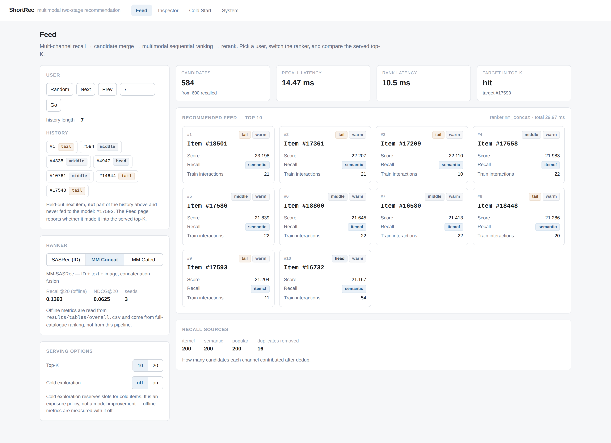
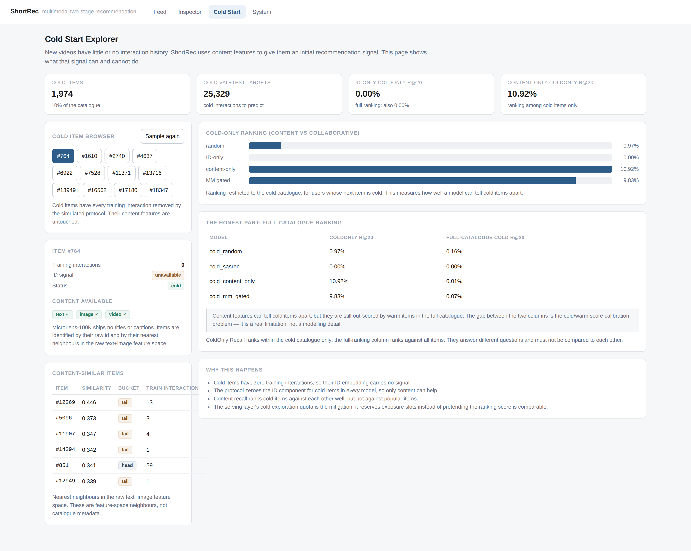

# ShortRec

**Multimodal two-stage recommendation for short-video feeds.**

ShortRec is a realistic two-stage recommendation prototype: multi-channel
candidate recall feeds a multimodal sequential ranker, with an explicit reranking
policy for cold-item exposure. It is built around one practical problem:

> How do you recommend **new and low-frequency videos** when collaborative
> interaction data is sparse or absent?

The system is an offline + serving prototype on the public **MicroLens-100K**
dataset — not a production deployment. Every number in this README is generated
from an artifact under `results/` by a command that is written down; nothing is
typed in by hand.

```
User Request → User History → Multi-channel Recall → Candidate Merge
             → MM-SASRec Ranker → Rerank → Top-K Feed
```

---

## The problem

A short-video platform produces new videos every day. Those videos have no
clicks, no watches, no co-occurrence — no collaborative signal at all. A model
that represents an item by a learned ID embedding has literally nothing to learn
for them. On MicroLens-100K this is not a corner case:

* 99.96 % of the user × item matrix is empty;
* the median item has a handful of training interactions;
* the tail (bottom 60 % of the catalogue) carries a large share of items;
* under the simulated cold split, 1 974 items have **zero** training interactions.

ShortRec attacks this from two directions: a **content-based recall channel** that
never looks at collaborative signal, and a **multimodal ranker** whose item
representation mixes ID with text and cover-image features.

## Key results

Full-catalogue ranking on the held-out test split, 3 seeds each:

| Model | Recall@20 | NDCG@20 | vs ID-only |
|---|---|---|---|
| SASRec (ID-only baseline) | 0.1224 ± 0.0025 | 0.0557 ± 0.0009 | — |
| **MM-SASRec (ID + text + image, concat)** | **0.1393 ± 0.0003** | **0.0625 ± 0.0001** | **+13.8 %** |
| MM-SASRec (ID + text + image, gated) | 0.1267 ± 0.0008 | 0.0567 ± 0.0006 | +3.5 % |

And the cold-start result, which is the reason the project exists:

| | ColdOnly Recall@20 | Full-catalogue cold Recall@20 |
|---|---|---|
| Random | 0.0097 | 0.0016 |
| SASRec (ID-only) | **0.0000** | 0.0000 |
| Content-only (text + image) | **0.1092** | 0.0001 |

An ID-only sequential model scores **exactly zero** on cold items. Content
features recover a real signal when ranking among cold items — but they are still
out-scored by warm items in the full catalogue. Both halves of that sentence are
results, and the second one is the honest limitation.

## System architecture

```
OFFLINE (batch)
  raw interactions
        │
        ▼
  preprocess ──► chronological leave-one-out split, training-only statistics
        │
        ├──► train ──► SASRec / MM-SASRec checkpoints
        │
        ├──► ItemCF neighbour index          artifacts/itemcf_neighbors.npz
        └──► content embeddings + Faiss      artifacts/content_embeddings.npy

ONLINE (this process, src/pipeline)
  user request
        │
        ▼
  ┌───────────── multi-channel recall ─────────────┐
  │  popular          itemcf          semantic      │
  │  (train freq)  (cosine co-occ)  (text+image,    │
  │                                  exact IP)      │
  └───────────────────────┬─────────────────────────┘
                          ▼
                  candidate merge / dedup
                   (reciprocal rank fusion,
                    every source kept on the item)
                          ▼
                  ~600 candidates
                          ▼
                  MM-SASRec ranker
             user sequence + ID + text + image
                          ▼
                  rerank  (seen filter, dedup,
                           cold exploration quota)
                          ▼
                       Top-K feed
```

The two stages report **different numbers** and are never mixed:

* `results/tables/overall.csv` — strict **full-catalogue** ranking over all
  19 738 items. This is model quality.
* `results/tables/pipeline_tradeoff.csv` — **two-stage serving simulation** with
  a candidate budget. This is deployment behaviour.

## Quick start

```bash
pip install -e ".[dev]"

# 1. data (190 MB, one time)
mkdir -p data/raw && (cd data/raw && \
  for f in microlens_100k.inter text_feat.npy image_feat.npy video_feat.npy; do
    curl -L -o "$f" "https://huggingface.co/datasets/sisuo/Microlens_100k/resolve/main/$f"
  done)

# 2. processed datasets
python -m src.data.preprocess --out data/processed/base
python -m src.data.preprocess --out data/processed/cold10 --cold-ratio 0.1 --cold-seed 42

# 3. train the two headline rankers (~25 min on one L40S)
python scripts/train.py --config configs/sasrec.yaml
python scripts/train.py --config configs/mm_sasrec_concat.yaml

# 4. build the recall indices
python scripts/prepare_demo.py

# 5. run the demo
bash scripts/start_demo.sh          # API :8000 + UI :5173
```

Open <http://127.0.0.1:5173>. The serving path is CPU-only by default; no GPU is
needed to run the demo once the checkpoints exist.

Sanity checks:

```bash
pytest -q
python scripts/smoke_test.py
python analysis/update_readme.py --check
```

## Two-stage pipeline

### 1. Candidate recall (`src/recall`)

Every channel implements one interface and returns at most `top_k` candidates,
with **PAD never returned** and **the user's own history always excluded**.

| channel | what it uses | what it is for |
|---|---|---|
| `popular` | training interaction counts | the always-available fallback; works for a brand-new user with no history |
| `itemcf` | cosine-normalised item co-occurrence, `sim(i,j) = |U_i∩U_j| / sqrt(|U_i||U_j|)`, top-100 neighbours precomputed offline | finds items that co-occur with what the user watched — the workhorse of industrial recall |
| `semantic` | `L2([L2(text) ; L2(image)])` content embedding, recency-weighted mean over the history, exact inner-product search | the only channel that can retrieve an item with **zero** interactions |

Per-modality normalisation in the semantic channel is not cosmetic: raw text
features are unit-norm while raw image features have norm ≈ 26, so concatenating
them un-normalised would silently turn it into an image-only channel.

> **Terminology.** Content retrieval uses `faiss.IndexFlatIP`, which is an
> **exact** inner-product index. It is not approximate nearest neighbour; that
> would need IVF/HNSW. Latencies reported here are exact-search latencies.

### 2. Candidate merge (`src/recall/pipeline.py`)

Channels produce incomparable scores — popularity counts (0…546), ItemCF
similarity sums (0…10), cosine similarities (−1…1). The merge therefore ranks by
**reciprocal rank fusion**:

```
merge_score(j) = Σ_channels 1 / (60 + rank_channel(j))
```

so no channel can dominate the pool just because its numbers are larger.
Duplicates are **merged, not dropped**: the candidate keeps every contributing
channel with its rank inside that channel, which is what the Inspector page
displays.

### 3. Ranking (`src/pipeline`)

The default ranker is **MM-SASRec with concatenation fusion** — the best
3-seed result in the offline table. `sasrec` (ID-only) and `mm_gated` are
selectable in the UI for comparison. Only the merged candidate pool is scored,
which is what makes the second stage cheap.

### 4. Reranking (`src/rerank/simple.py`)

Three policies and nothing more: seen filter, dedup, and an optional
**cold exploration quota** that guarantees at least *N* cold items reach the final
list.

The quota is an **exposure policy, not a model improvement**. Offline metrics are
measured with it off. It exists because the cold-item experiment shows content
alone cannot out-score warm items in the full catalogue, so without a quota cold
items would receive no impressions at all.

## API

```
GET /system                      dataset, rankers, recall channels, readiness
GET /models                      rankers + offline metrics from results/tables
GET /users/{u}                   history with cold / bucket metadata
GET /users/{u}/recall            candidate generation with per-source trace
GET /users/{u}/recommend         the served top-K
GET /users/{u}/inspect           full request trace (Inspector page)
GET /cold/summary                cold-start experiment results
GET /cold/items[/{id}]           cold items + content availability
POST /recommend                  legacy history-based endpoint
```

```bash
curl -s --noproxy '*' localhost:8000/users/7/recommend?top_k=5
```

```json
{
  "user_id": 7,
  "history": [1, 1163, 6197, 2514],
  "recall": {"per_source": {"popular": 200, "itemcf": 200, "semantic": 200},
             "before_dedup": 600, "after_dedup": 584},
  "recommendations": [
    {"item_id": 18501, "ranking_score": 23.198, "final_rank": 1,
     "sources": ["semantic"], "recall_rank": {"semantic": 13},
     "is_cold": false, "popularity_bucket": "tail", "train_interactions": 21}
  ]
}
```

Item ids in the API are **raw MicroLens ids**. The conversion from the internal
`1..N` id space happens in exactly one place (`src/serving/service.py`).

## Demo



<p align="center"><em>Feed — user history, served top-K with recall source, popularity bucket and cold status, and ranker switching with the offline metrics beside it.</em></p>

| route | page | what it shows |
|---|---|---|
| `/` | **Feed** | user picker, history, served top-K with score / recall source / bucket / cold status, ranker switch with offline metrics |
| `/inspect` | **Recommendation Inspector** | the full trace: recall → merge → ranking → rerank, a sortable candidate table, and what the multimodal model moved **up and down** relative to the ID-only baseline |
| `/cold` | **Cold Start Explorer** | sample cold items with content availability, the cold-only vs full-catalogue experiment gap, and content-space neighbours |
| `/system` | **System** | dataset, recall channel readiness, catalogue buckets, rankers with offline metrics, architecture |


<p align="center"><em>Recommendation Inspector — recall → merge → rank → rerank for one request, plus what the multimodal model moved up and down relative to the ID-only baseline.</em></p>



<p align="center"><em>Cold Start Explorer — an item with zero training interactions, its content availability, and the cold-only vs full-catalogue experiment gap.</em></p>

MicroLens-100K ships **no item titles or captions**. The UI therefore shows
`Item #1234` and, where useful, *content-similar* items from the raw feature
space — labelled as such. No titles are invented.

## Offline evaluation of the recall layer

<!-- TABLE:RECALL -->
| Channel | Recall@100 | Recall@200 | Recall@500 | Recall@1000 |
|---|---|---|---|---|
| popular | 0.0170 | 0.0299 | 0.0625 | 0.1071 |
| itemcf | 0.1487 | 0.1852 | 0.2376 | 0.2479 |
| semantic | 0.0732 | 0.1004 | 0.1555 | 0.2225 |
| merged | 0.1269 | 0.1652 | 0.2327 | 0.3004 |

_Test target, user history masked, 100000 users. Candidate-generation quality: this is the ceiling the ranker can reach._
<!-- /TABLE:RECALL -->

ItemCF is the strongest single channel at small budgets. Semantic recall starts
weaker but **catches up as the budget grows** (0.073 → 0.223 from K=100 to
K=1000): content similarity finds items the collaborative channels rank low, they
just are not at the very top. The merged pool beats every single channel at every
budget — 0.3004 at K=1000 versus 0.2479 for the best channel alone — which is the
argument for multi-channel recall rather than tuning one channel harder.

The bucket split shows the merged pool covering the tail (0.2524) as well as the
middle (0.2516) and better than either channel alone, so the extra coverage is
not coming at the tail's expense.

### Which channel actually produced the recommendations?

<!-- TABLE:SOURCES -->
| Source | Top-20 hits | Share | Head hits | Middle hits | Tail hits |
|---|---|---|---|---|---|
| popular | 41 | 0.0296 | 41 | 0 | 0 |
| itemcf | 489 | 0.3536 | 194 | 124 | 171 |
| semantic | 90 | 0.0651 | 37 | 21 | 32 |
| multiple | 763 | 0.5517 | 364 | 146 | 253 |

_Candidate budget 1000. `multiple` means the item was found by more than one channel._
<!-- /TABLE:SOURCES -->

## Two-stage trade-off: candidate size vs accuracy vs latency

<!-- TABLE:PIPELINE -->
| Candidate budget | Candidate recall | Final Recall@20 | Final NDCG@20 | Recall latency (ms) | Rank latency (ms) |
|---|---|---|---|---|---|
| 100 | 0.1433 | 0.1152 | 0.0608 | 16.9 | 5.87 |
| 200 | 0.1787 | 0.1256 | 0.0641 | 17.0 | 6.05 |
| 500 | 0.2463 | 0.1364 | 0.0674 | 19.0 | 6.18 |
| 1000 | 0.3128 | 0.1383 | 0.0672 | 17.5 | 6.52 |

For reference, ranking the **entire** catalogue (19738 items) costs 6.57 ms on the same machine — essentially the same as a 100-item pool, because the ranker's cost here is dominated by encoding the user sequence, not by scoring candidates.

_10000 users for accuracy; latency from a separate benchmark (150 users × 20 repetitions, minimum reported). Ranker `mm_concat`, CPU serving. Candidate recall is the share of users whose next item is in the pool at all — the hard ceiling of the pipeline._
<!-- /TABLE:PIPELINE -->

This is the deployment question: how large does the candidate pool have to be
before the ranker stops being the bottleneck, and what does that cost in latency?

The pipeline reaches **0.1383 final Recall@20 at a 1 000-candidate budget**, i.e.
**99 % of the same model's full-catalogue score (0.1393)** while ranking 1 000
items instead of 19 738. Most of the gain is already there at 500 candidates
(0.1364, 98 %). Candidate recall is the ceiling, and at 500 candidates it is
0.2463 while the final Recall@20 is 0.1364 — so the **ranker, not the recall
layer, is the bottleneck** at every budget measured here.

**The latency result is not the one the architecture diagram suggests.** At this
catalogue size the ranker's cost is dominated by encoding the user sequence, not
by the candidate matmul: scoring 100 candidates costs 5.9 ms and scoring all
19 738 costs 6.6 ms. So on MicroLens-100K the two-stage split buys **recall
quality and headroom for a much larger catalogue**, not latency. Claiming a
latency win here would be dishonest — the honest claim is that the pipeline loses
almost nothing in accuracy while making catalogue size almost irrelevant to the
ranking cost.

(An operational note that mattered more than any of this: PyTorch defaults to one
thread per core, and inside FastAPI a sync endpoint runs in a threadpool, so each
request was spawning ~20 OpenMP threads on an already-busy machine. Capping
intra-op threads at 1 took the same request from ~190 ms to ~9 ms. See
`configure_threads` in `src/serving/app.py`.)

## Model results (full-catalogue ranking)

Strict offline evaluation: every user, every item, the user's history masked, the
ground truth never masked. **This is not the same measurement as the pipeline
tables above.**

<!-- TABLE:OVERALL -->
| Model | Recall@10 | Recall@20 | NDCG@10 | NDCG@20 | MRR@20 | Coverage@20 | Params | #seeds |
|---|---|---|---|---|---|---|---|---|
| Popular (train-freq) | 0.0023 ± 0.0000 | 0.0036 ± 0.0000 | 0.0011 ± 0.0000 | 0.0014 ± 0.0000 | 0.0008 ± 0.0000 | 0.0025 ± 0.0000 | 0 | 3 |
| BPR-MF | 0.0199 ± 0.0001 | 0.0331 ± 0.0003 | 0.0096 ± 0.0001 | 0.0129 ± 0.0001 | 0.0074 ± 0.0001 | 0.7275 ± 0.0121 | 15326720 | 3 |
| SASRec (ID-only) | 0.0852 ± 0.0012 | 0.1224 ± 0.0025 | 0.0463 ± 0.0006 | 0.0557 ± 0.0009 | 0.0371 ± 0.0005 | 0.8017 ± 0.0212 | 2929792 | 3 |
| SASRec (ID-only) + item-dropout 0.2 | 0.0886 ± 0.0008 | 0.1283 ± 0.0011 | 0.0479 ± 0.0002 | 0.0579 ± 0.0001 | 0.0382 ± 0.0005 | 0.7426 ± 0.0155 | 2929920 | 3 |
| MM-SASRec (id+image, gated) | 0.0851 | 0.1237 | 0.0463 | 0.0560 | 0.0371 | 0.8438 | 3096322 | 1 |
| MM-SASRec (id+text, gated) | 0.0821 | 0.1176 | 0.0448 | 0.0538 | 0.0360 | 0.8524 | 3046402 | 1 |
| MM-SASRec (id+text+image+video, gated) | 0.0879 | 0.1271 | 0.0475 | 0.0574 | 0.0380 | 0.7668 | 3345668 | 1 |
| MM-SASRec (image, gated) | 0.0541 | 0.0874 | 0.0267 | 0.0351 | 0.0207 | 0.2746 | 536705 | 1 |
| MM-SASRec (text+image, gated) | 0.0704 | 0.1126 | 0.0355 | 0.0461 | 0.0278 | 0.3555 | 619778 | 1 |
| MM-SASRec (text, gated) | 0.0413 | 0.0702 | 0.0196 | 0.0269 | 0.0151 | 0.2455 | 486785 | 1 |
| MM-SASRec (video, gated) | 0.0570 | 0.0905 | 0.0281 | 0.0365 | 0.0217 | 0.2872 | 569985 | 1 |
| MM-SASRec (id+text+image, concat) | 0.0960 ± 0.0002 | 0.1393 ± 0.0003 | 0.0516 ± 0.0001 | 0.0625 ± 0.0001 | 0.0412 ± 0.0001 | 0.7708 ± 0.0107 | 3212288 | 3 |
| MM-SASRec (id+text+image, concat) + ID-dropout 0.2 | 0.0982 ± 0.0015 | 0.1429 ± 0.0013 | 0.0524 ± 0.0011 | 0.0637 ± 0.0010 | 0.0416 ± 0.0009 | 0.7531 ± 0.0039 | 3212288 | 2 |
| MM-SASRec (id+text+image, gated) | 0.0868 ± 0.0006 | 0.1267 ± 0.0008 | 0.0466 ± 0.0006 | 0.0567 ± 0.0006 | 0.0372 ± 0.0006 | 0.7388 ± 0.0210 | 3179395 | 3 |
| MM-SASRec (id+text+image, gated) + ID-dropout 0.2 | 0.0902 ± 0.0012 | 0.1314 ± 0.0007 | 0.0487 ± 0.0007 | 0.0591 ± 0.0005 | 0.0390 ± 0.0005 | 0.7891 ± 0.0183 | 3179395 | 3 |
<!-- /TABLE:OVERALL -->

<!-- TABLE:FINDINGS -->
- **Ordering holds** — Popular 0.0036 < BPR-MF 0.0331 < SASRec 0.1224 test Recall@20 over 100 000 evaluated test users (3 runs / 3 runs / 3 runs respectively).
- **Gain_reg** (item-dropout control) = SASRec+item-dropout 0.2 − SASRec = +0.0059 test Recall@20 over 100 000 users (3 runs vs 3 runs); NDCG@20 +0.0022.
- **Gain_content** (over the dropout control) = MM-SASRec gated+ID-dropout 0.2 − SASRec+item-dropout 0.2 = +0.0031 test Recall@20 over 100 000 users (3 runs vs 3 runs); NDCG@20 +0.0012.
- **Multimodal vs ID-only** = 100 000 users: Recall@20 0.1224 (ID-only) → 0.1314, NDCG@20 0.0557 → 0.0591.
- **Fusion without ID dropout** — gated 0.1267 vs concat 0.1393 test Recall@20 vs ID-only 0.1224 (same 100 000 users); Δ vs ID-only gated +0.0043, concat +0.0169. With ID-dropout 0.2 the order is unchanged: gated 0.1314 vs concat 0.1429.
- **Long tail** (buckets from training interactions only, rule `frequency_quantile`, 3 runs), Recall@20 — head: ID-only 0.1878 → MM 0.2031 (+0.0153), vs dropout control (0.1953) +0.0078; middle: ID-only 0.1185 → MM 0.1270 (+0.0085), vs dropout control (0.1256) +0.0014; tail: ID-only 0.0752 → MM 0.0797 (+0.0045), vs dropout control (0.0794) +0.0003. Bucket sizes: head 33 521 users, middle 21 904 users, tail 44 575 users. Concat+ID-dropout 0.2 reaches tail 0.0881 (+0.0087 vs the same dropout control).
- **Cold items** (cold catalogue = 1 974 items, 12 717 users with a cold target): cold-only Recall@20 — theoretical uniform ranker 20/1974 = 0.0101, measured Random 0.0097, SASRec ID-only 0.0000, content-only MM-SASRec 0.1092, gated MM-SASRec 0.0983 (0.0789 with ID-dropout 0.2).
_Every value above is computed from `results/tables/*.csv` by `analysis/make_readme_tables.py`; recall denominators are the evaluated test users named in each line._
<!-- /TABLE:FINDINGS -->

### Modality / fusion ablation

<!-- TABLE:ABLATION -->
| Kind | ID | Text | Image | Video | Fusion | ID-dropout | Item-dropout | Recall@10 | Recall@20 | NDCG@20 | Params |
|---|---|---|---|---|---|---|---|---|---|---|---|
| ID-only | ✓ |  |  |  | - | — | — | 0.0852 ± 0.0012 | 0.1224 ± 0.0025 | 0.0557 ± 0.0009 | 2929792 |
| ID-only | ✓ |  |  |  | - | — | 0.2 | 0.0886 ± 0.0008 | 0.1283 ± 0.0011 | 0.0579 ± 0.0001 | 2929920 |
| MM |  |  |  | ✓ | gated | — | — | 0.0570 | 0.0905 | 0.0365 | 569985 |
| MM |  |  | ✓ |  | gated | — | — | 0.0541 | 0.0874 | 0.0351 | 536705 |
| MM |  | ✓ |  |  | gated | — | — | 0.0413 | 0.0702 | 0.0269 | 486785 |
| MM |  | ✓ | ✓ |  | gated | — | — | 0.0704 | 0.1126 | 0.0461 | 619778 |
| MM | ✓ |  | ✓ |  | gated | — | — | 0.0851 | 0.1237 | 0.0560 | 3096322 |
| MM | ✓ | ✓ |  |  | gated | — | — | 0.0821 | 0.1176 | 0.0538 | 3046402 |
| MM | ✓ | ✓ | ✓ |  | concat | — | — | 0.0960 ± 0.0002 | 0.1393 ± 0.0003 | 0.0625 ± 0.0001 | 3212288 |
| MM | ✓ | ✓ | ✓ |  | concat | 0.2 | — | 0.0982 ± 0.0015 | 0.1429 ± 0.0013 | 0.0637 ± 0.0010 | 3212288 |
| MM | ✓ | ✓ | ✓ |  | gated | — | — | 0.0868 ± 0.0006 | 0.1267 ± 0.0008 | 0.0567 ± 0.0006 | 3179395 |
| MM | ✓ | ✓ | ✓ |  | gated | 0.2 | — | 0.0902 ± 0.0012 | 0.1314 ± 0.0007 | 0.0591 ± 0.0005 | 3179395 |
| MM | ✓ | ✓ | ✓ | ✓ | gated | — | — | 0.0879 | 0.1271 | 0.0574 | 3345668 |
<!-- /TABLE:ABLATION -->

### Long-tail analysis

<!-- TABLE:LONGTAIL -->
_Popularity rule: `frequency_quantile` (training interactions only)._

| Model | Head Recall@20 | Middle Recall@20 | Tail Recall@20 | Head NDCG@20 | Middle NDCG@20 | Tail NDCG@20 |
|---|---|---|---|---|---|---|
| BPR-MF | 0.0728 ± 0.0009 | 0.0232 ± 0.0007 | 0.0082 ± 0.0010 | 0.0290 ± 0.0002 | 0.0091 ± 0.0003 | 0.0027 ± 0.0003 |
| MM-SASRec (id+image, gated) | 0.2006 | 0.1182 | 0.0686 | 0.0948 | 0.0530 | 0.0283 |
| MM-SASRec (id+text, gated) | 0.1936 | 0.1118 | 0.0632 | 0.0934 | 0.0497 | 0.0260 |
| MM-SASRec (id+text+image+video, gated) | 0.2064 | 0.1233 | 0.0692 | 0.0985 | 0.0545 | 0.0279 |
| MM-SASRec (image, gated) | 0.1989 | 0.0553 | 0.0194 | 0.0848 | 0.0184 | 0.0058 |
| MM-SASRec (text+image, gated) | 0.2256 | 0.0999 | 0.0339 | 0.0990 | 0.0366 | 0.0109 |
| MM-SASRec (text, gated) | 0.1736 | 0.0282 | 0.0130 | 0.0692 | 0.0089 | 0.0039 |
| MM-SASRec (video, gated) | 0.2039 | 0.0715 | 0.0145 | 0.0856 | 0.0262 | 0.0047 |
| MM-SASRec (id+text+image, concat) | 0.2145 ± 0.0021 | 0.1330 ± 0.0016 | 0.0858 ± 0.0017 | 0.1008 ± 0.0007 | 0.0590 ± 0.0005 | 0.0355 ± 0.0008 |
| MM-SASRec (id+text+image, concat) + ID-dropout 0.2 | 0.2189 ± 0.0011 | 0.1380 ± 0.0007 | 0.0881 ± 0.0017 | 0.1027 ± 0.0003 | 0.0608 ± 0.0010 | 0.0357 ± 0.0015 |
| MM-SASRec (id+text+image, gated) | 0.2103 ± 0.0045 | 0.1204 ± 0.0018 | 0.0670 ± 0.0036 | 0.0996 ± 0.0013 | 0.0527 ± 0.0007 | 0.0264 ± 0.0018 |
| MM-SASRec (id+text+image, gated) + ID-dropout 0.2 | 0.2031 ± 0.0020 | 0.1270 ± 0.0045 | 0.0797 ± 0.0024 | 0.0968 ± 0.0008 | 0.0565 ± 0.0011 | 0.0321 ± 0.0013 |
| Popular (train-freq) | 0.0106 ± 0.0000 | 0.0000 ± 0.0000 | 0.0000 ± 0.0000 | 0.0043 ± 0.0000 | 0.0000 ± 0.0000 | 0.0000 ± 0.0000 |
| SASRec (ID-only) | 0.1878 ± 0.0040 | 0.1185 ± 0.0042 | 0.0752 ± 0.0006 | 0.0885 ± 0.0025 | 0.0538 ± 0.0022 | 0.0320 ± 0.0008 |
| SASRec (ID-only) + item-dropout 0.2 | 0.1953 ± 0.0025 | 0.1256 ± 0.0021 | 0.0794 ± 0.0004 | 0.0923 ± 0.0005 | 0.0564 ± 0.0005 | 0.0327 ± 0.0004 |
<!-- /TABLE:LONGTAIL -->

### Where does the multimodal gain come from?

`Δ vs SASRec` answers "does multimodal help?". `Δ vs ID+item-dropout` answers
"is it the *content* or just the extra regularisation?". Both are needed.

<!-- TABLE:GAIN -->
| Model | ΔHead vs SASRec | ΔMiddle vs SASRec | ΔTail vs SASRec | ΔHead vs ID+item-drop | ΔMiddle vs ID+item-drop | ΔTail vs ID+item-drop |
|---|---|---|---|---|---|---|
| MM-SASRec (id+image, gated) | +0.0129 | -0.0003 | -0.0066 | +0.0053 | -0.0074 | -0.0108 |
| MM-SASRec (id+text, gated) | +0.0058 | -0.0067 | -0.0120 | -0.0017 | -0.0138 | -0.0162 |
| MM-SASRec (id+text+image+video, gated) | +0.0186 | +0.0048 | -0.0060 | +0.0111 | -0.0023 | -0.0102 |
| MM-SASRec (image, gated) | +0.0111 | -0.0632 | -0.0558 | +0.0036 | -0.0703 | -0.0600 |
| MM-SASRec (text+image, gated) | +0.0378 | -0.0186 | -0.0413 | +0.0303 | -0.0257 | -0.0455 |
| MM-SASRec (text, gated) | -0.0142 | -0.0903 | -0.0622 | -0.0217 | -0.0974 | -0.0664 |
| MM-SASRec (video, gated) | +0.0161 | -0.0470 | -0.0607 | +0.0086 | -0.0541 | -0.0649 |
| MM-SASRec (id+text+image, concat) | +0.0267 | +0.0145 | +0.0106 | +0.0192 | +0.0074 | +0.0064 |
| MM-SASRec (id+text+image, concat) + ID-dropout 0.2 | +0.0311 | +0.0195 | +0.0129 | +0.0236 | +0.0124 | +0.0087 |
| MM-SASRec (id+text+image, gated) | +0.0225 | +0.0019 | -0.0082 | +0.0150 | -0.0052 | -0.0124 |
| MM-SASRec (id+text+image, gated) + ID-dropout 0.2 | +0.0153 | +0.0085 | +0.0045 | +0.0078 | +0.0014 | +0.0003 |
<!-- /TABLE:GAIN -->

### Gate analysis

`python scripts/export_gates.py --run-dir <mm run>` then
`python analysis/analyze_gates.py` produce
`results/figures/modality_gate_distribution.png`.

<!-- TABLE:GATES -->
_Mean over 13 documented run(s), from `results/tables/gate_by_bucket.csv`._

| Model | Modality | Head | Middle | Tail | Cold |
|---|---|---|---|---|---|
| mm_sasrec(id+image) | id | 0.988 | 0.989 | 0.984 | TBD |
| mm_sasrec(id+image) | image | 0.012 | 0.011 | 0.016 | TBD |
| mm_sasrec(id+text) | id | 0.977 | 0.981 | 0.974 | TBD |
| mm_sasrec(id+text) | text | 0.023 | 0.019 | 0.026 | TBD |
| mm_sasrec(id+text+image) | id | 0.964 | 0.965 | 0.954 | TBD |
| mm_sasrec(id+text+image) | image | 0.013 | 0.013 | 0.019 | TBD |
| mm_sasrec(id+text+image) | text | 0.024 | 0.022 | 0.027 | TBD |
| mm_sasrec(id+text+image)@cold10 | id | 0.984 | 0.984 | 0.812 | 0.000 |
| mm_sasrec(id+text+image)@cold10 | image | 0.006 | 0.006 | 0.087 | 0.480 |
| mm_sasrec(id+text+image)@cold10 | text | 0.009 | 0.009 | 0.100 | 0.520 |
| mm_sasrec(id+text+image+video) | id | 0.960 | 0.959 | 0.944 | TBD |
| mm_sasrec(id+text+image+video) | image | 0.012 | 0.012 | 0.017 | TBD |
| mm_sasrec(id+text+image+video) | text | 0.021 | 0.020 | 0.024 | TBD |
| mm_sasrec(id+text+image+video) | video | 0.007 | 0.009 | 0.015 | TBD |
| mm_sasrec(text+image) | image | 0.613 | 0.635 | 0.623 | TBD |
| mm_sasrec(text+image) | text | 0.387 | 0.365 | 0.377 | TBD |
| mm_sasrec(text+image)@cold10 | image | 0.652 | 0.665 | 0.651 | 0.641 |
| mm_sasrec(text+image)@cold10 | text | 0.348 | 0.335 | 0.349 | 0.359 |
| mm_sasrec_iddrop(id+text+image) | id | 0.967 | 0.961 | 0.939 | TBD |
| mm_sasrec_iddrop(id+text+image) | image | 0.016 | 0.019 | 0.029 | TBD |
| mm_sasrec_iddrop(id+text+image) | text | 0.017 | 0.020 | 0.033 | TBD |
| mm_sasrec_iddrop(id+text+image)@cold10 | id | 0.969 | 0.963 | 0.785 | 0.000 |
| mm_sasrec_iddrop(id+text+image)@cold10 | image | 0.013 | 0.015 | 0.150 | 0.797 |
| mm_sasrec_iddrop(id+text+image)@cold10 | text | 0.018 | 0.022 | 0.065 | 0.203 |
<!-- /TABLE:GATES -->

The expected trend is present — the ID weight falls and the content weights rise
monotonically from head to tail — but the magnitude is small. The model keeps
most of its weight on the ID branch, which is exactly why naive gated fusion
underperforms the ID-only baseline and why ID dropout is needed.

## Cold-start analysis

Simulated cold split: 10 % of items have **every training interaction removed**;
they keep their content features and their ID representation is zeroed at
inference for every model. 12 717 users have a cold test target.

`Cold *` = full ranking over all items for users whose target is cold.
`ColdOnly *` = ranking restricted to the cold catalogue.

<!-- TABLE:COLD -->
| Model | Cold Recall@10 | Cold Recall@20 | Cold NDCG@10 | Cold NDCG@20 | ColdOnly Recall@10 | ColdOnly Recall@20 | #users with cold target |
|---|---|---|---|---|---|---|---|
| MM-SASRec (text+image, gated) [cold10] | 0.0001 | 0.0001 | 0.0000 | 0.0000 | 0.0687 | 0.1092 | 12717 |
| MM-SASRec (id+text+image, gated) [cold10] | 0.0002 | 0.0007 | 0.0001 | 0.0002 | 0.0646 | 0.0983 | 12717 |
| MM-SASRec (id+text+image, gated) + ID-dropout 0.2 [cold10] | 0.0001 | 0.0008 | 0.0000 | 0.0002 | 0.0456 | 0.0789 | 12717 |
| Random (uniform) [cold10] | 0.0013 | 0.0016 | 0.0006 | 0.0007 | 0.0036 | 0.0097 | 12717 |
| SASRec (ID-only) [cold10] | 0.0000 | 0.0000 | 0.0000 | 0.0000 | 0.0000 | 0.0000 | 12717 |
<!-- /TABLE:COLD -->

The two columns answer different questions and must not be compared to each
other. The gap between them is the **cold/warm score calibration problem**: a
content model can tell cold items apart from each other, but their scores are not
comparable to warm items' scores in a shared ranking. That is what the serving
layer's cold exploration quota exists to mitigate.

Ranks use the **average-rank tie policy**. With an optimistic policy, the 1 974
cold items all tied at score 0 would each be reported as a perfect hit — a
measurement artefact rather than a result.

## Efficiency

<!-- TABLE:EFFICIENCY -->
|  | value |
|---|---|
| SASRec (ID-only) parameters | 2 929 792 |
| MM-SASRec (gated) parameters | 3 179 395 (+8.5 %) |
| epochs trained (SASRec / MM) | 80 / 70 |
| wall time per epoch (SASRec / MM) | 14.4 / 20.8 s |
| total training time (SASRec / MM) | 1 164 / 1 457 s |
| evaluation | full ranking, 100 000 users x 19 738 items |
| runs behind these numbers | 6 |
| vector index | faiss.IndexFlatIP (exact inner product) |
| index build / query latency | 0.0417 s / 0.5017 ms per query |
<!-- /TABLE:EFFICIENCY -->

## Advanced extension: Semantic IDs and generative retrieval

`src/models/rqvae.py`, `src/models/semantic_id.py`, `src/models/generative_rec.py`

Content embeddings are quantised into Semantic IDs with an RQVAE, and a small
causal Transformer generates the next item's ID instead of scoring vectors.
This is an **extension**, not part of the main architecture.

<!-- TABLE:SEMANTICID -->
|  |  |
|---|---|
| source features | `text+image(L2-normalised per modality)` |
| quantiser | RQVAE, 4 levels × 256 codes, latent 64 (1 471 168 params) |
| reconstruction cosine | 0.681 |
| codebook utilisation | `[1.0, 1.0, 1.0, 1.0]` |
| unique Semantic IDs | 19 692 / 19 738 items |
| collision rate | **0.233 %** |
<!-- /TABLE:SEMANTICID -->

Three things had to be fixed before the codes were usable, all documented in the
code: residual-aware code re-seeding, the commitment term, and per-modality
normalisation. With random codebook initialisation and a codebook-only loss the
collision rate was **49 %**, which would have made generative retrieval
meaningless.

Decoding is constrained by a prefix trie, so the generator can only emit a code
tuple that corresponds to a real item — never a hallucinated one, and never a
random fallback.

## Dataset

MicroLens-100K, downloaded from `huggingface.co/datasets/sisuo/Microlens_100k`.
Full schema evidence in [`docs/data_schema.md`](docs/data_schema.md).

<!-- TABLE:DATASET -->
| split | users | items | interactions | sparsity | mean seq len | train interactions | median train item freq | items with 0 train freq | cold items |
|---|---|---|---|---|---|---|---|---|---|
| `base` | 100000 | 19738 | 719405 | 0.99964 | 7.19 | 519405 | 15.0 | 376 | 0 |
| `cold10` | 99942 | 19738 | 659400 | 0.99967 | 6.60 | 459516 | 12.0 | 2300 | 1974 |
<!-- /TABLE:DATASET -->

### Data leakage policy

| signal | source |
|---|---|
| item frequency, popularity buckets, recall scores | **training interactions only** |
| ItemCF similarities, negative sampling | training interactions only |
| cold-item selection | training protocol + fixed seed |
| `x_label` / likes / views | **not used at all** |
| evaluation | full ranking, user history masked, ground truth protected |

`ProcessedData.assert_no_target_leak()` re-checks on every load that no
validation target appears in the train history and no test target appears in the
train+val history. Details in [`docs/evaluation_protocol.md`](docs/evaluation_protocol.md).

## Repository structure

```
configs/          one YAML per experiment
docs/             data_schema.md, evaluation_protocol.md, design.md
src/data/         preprocessing, datasets, negative sampling, popularity, metadata
src/models/       bpr, sasrec, mm_sasrec, item_encoder, fusion, rqvae, generative_rec
src/recall/       popular, itemcf, semantic channels + candidate merge
src/rerank/       seen filter, dedup, cold exploration quota
src/pipeline/     ranker registry + two-stage recommender
src/evaluation/   metrics, full-ranking evaluator, cold/tail slicing
src/training/     model factory, trainer (AMP, early stopping, checkpointing)
src/retrieval/    exact inner-product index (Faiss, with numpy fallback)
src/serving/      service, schemas, FastAPI app
scripts/          CLI entry points (train, prepare_demo, evaluate_recall, ...)
analysis/         aggregation, plotting, gate analysis, README table generation
frontend/         React + Vite + TypeScript demo (Feed / Inspector / Cold / System)
tests/            unit + integration tests
results/          runs/, tables/, figures/   (generated)
artifacts/        indices, semantic IDs, demo manifest   (generated)
```

## Reproducibility

```python
set_seed(seed)   # random, numpy, torch (CPU + CUDA), PYTHONHASHSEED
```

Negative sampling, cold-item selection and popularity bucketing use explicitly
seeded generators. Training data is fully in memory with `num_workers = 0`, so
there is no worker-seeding ambiguity. Checkpoints store a dataset hash and refuse
to load into a dataset with a different item mapping or cold split.

GPU kernels are not guaranteed to be bitwise deterministic. Runs are reproducible
in distribution: same config + same seed ⇒ identical data order, negative samples
and initialisation.

## Limitations

* **This is not a production system.** It is an offline + serving prototype on a
  public dataset with a 19.7 K item catalogue. There is no streaming ingestion,
  no feature store, no A/B harness.
* MicroLens-100K has short histories (median 6 interactions), which caps what any
  sequential model can learn.
* The subset ships **no item titles or captions**, so the demo identifies items by
  raw id and content-space neighbours only.
* The cold protocol is **simulated** (interactions removed by a fixed seed), not a
  naturally occurring cold-start stream.
* Validation is used for early stopping, so validation numbers are optimistic;
  test numbers are reported from the best checkpoint.
* Cold items remain poorly calibrated against warm items in the full catalogue.
  The exploration quota is a mitigation, not a solution.
* Video features are wired through the architecture but the headline tables use
  ID + text + image; the video ablation is reported separately.
* Serving is single-process and CPU-only by default; the API has no
  authentication, rate limiting or caching.

## Reproducing the numbers

```bash
python analysis/aggregate_results.py     # results/tables/*.csv from results/runs/
python analysis/update_readme.py         # inject the tables into this README
python analysis/plot_overall.py
python analysis/plot_long_tail.py
python analysis/plot_cold_start.py
python scripts/export_gates.py --run-dir results/runs/<mm run>
python analysis/analyze_gates.py
python scripts/evaluate_recall.py
python scripts/evaluate_pipeline.py
```

`python analysis/update_readme.py --check` fails if this README and
`results/tables/*.csv` disagree.
